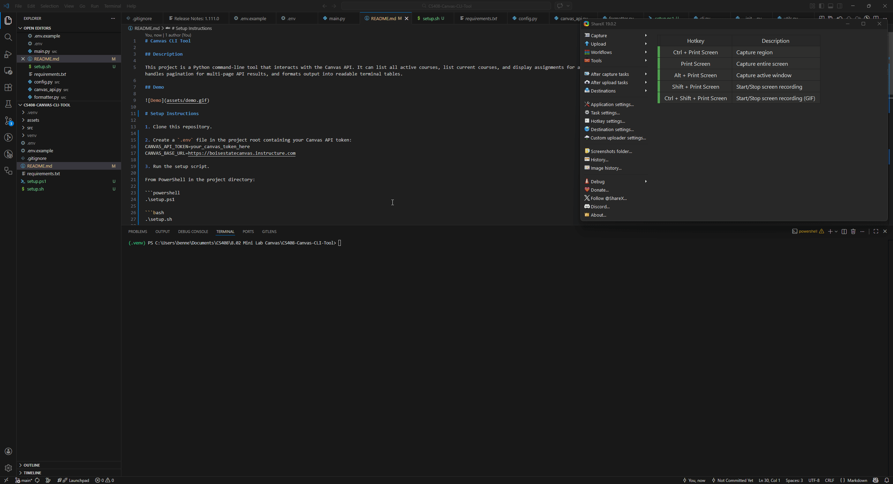

# Canvas CLI Tool

## Description

This project is a Python command-line tool that interacts with the Canvas API. It can list all active courses, list current courses, and display assignments for a selected course. The tool uses environment variables to securely store the Canvas API token, handles pagination for multi-page API results, and formats output into readable terminal tables.

## Demo



# Setup Instructions

1. Clone this repository.

2. Create a `.env` file in the project root containing your Canvas API token:
CANVAS_API_TOKEN=your_canvas_token_here
CANVAS_BASE_URL=https://boisestatecanvas.instructure.com

3. Run the setup script.

From PowerShell in the project directory:

```powershell
.\setup.ps1
```

OR

From Command Line in the project directory:
```bash
.\setup.sh
```

The setup script will automatically:

- create the Python virtual environment if it does not exist
- activate the virtual environment
- install required dependencies
- verify that your .env file exists

After the script finishes, you can run the CLI commands in the same terminal.

## Usage Examples
List all active courses:
Ex: python -m src.main all-courses

List current courses based off of dates:
Ex: python -m src.main current-courses

List assignments for a course based off of course_id from other usages:
EX: python -m src.main assignments --course-id 12345

## API Endpoints Used
GET /api/v1/courses

GET /api/v1/courses/:course_id/assignments

## Reflection
One challenge in this project was filtering Canvas course results so that old or irrelevant courses did not dominate the output. Canvas returns a large number of courses tied to an account, including past courses, student groups, and organizational shells. To solve this, the program filters courses based on activity dates and removes entries that clearly are not actual classes.

Another important part of the project was handling pagination. The Canvas API often returns results across multiple pages, so the program follows pagination links until all results are retrieved. This ensures that the CLI tool returns complete data instead of just the first page.

Finally, formatting the output into readable terminal tables significantly improves usability compared to printing raw JSON data, making the tool easier to use from the command line.